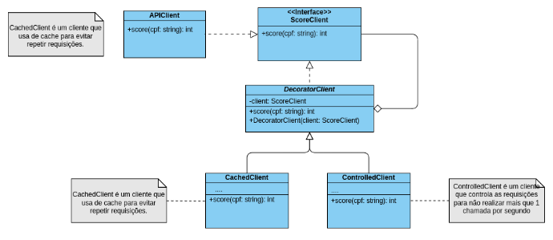

# Decorator-Request

Este projeto implementa uma solução utilizando o padrão de projeto **Decorator** para lidar com restrições de uma API de consulta de crédito, conforme descrito no exercício. A API impõe um limite de 1 requisição por segundo, e o sistema foi desenhado para respeitar essa limitação e também implementar um cache para evitar requisições desnecessárias.

## Descrição

A solução envolve três classes principais além de uma interface `ScoreClient`:

- **APIClient:** Responsável por fazer a consulta diretamente à API.
- **CachedClient:** Estende o comportamento de `APIClient` adicionando a funcionalidade de cache para que, quando o mesmo CPF for consultado mais de uma vez, o resultado seja recuperado do cache em vez de fazer uma nova requisição.
- **ControlledClient:** Adiciona controle de fluxo para garantir que não mais de uma requisição seja feita por segundo, respeitando as limitações impostas pela API.

### Fluxo de Funcionamento
A aplicação faz a requisição do score de crédito para um CPF, utilizando uma cadeia de objetos que seguem o padrão Decorator:

```java
ScoreClient client = new CachedClient(new ControlledClient(new APIClient()));
```

Neste fluxo, primeiro o `CachedClient` verifica se o CPF já está no cache. Se não estiver, a requisição é passada para o `ControlledClient`, que gerencia a frequência das requisições para a API e, finalmente, a `APIClient` realiza a consulta diretamente.

## Instruções de Execução

1. **Dependências:**
   - A biblioteca JSON usada no projeto é a `org.json`. Você pode baixar o `.jar` diretamente [neste link](https://mvnrepository.com/artifact/org.json/json/20210307) ou adicionar via Maven ao seu projeto.
   - Certifique-se de que a API utilizada no projeto está acessível:
     - URL da API: `https://score.hsborges.dev/api/score?cpf=<cpf>`

2. **Compilação e Execução:**
   - Compile todas as classes usando seu compilador Java favorito, ou configure o projeto em uma IDE como IntelliJ IDEA ou NetBeans.
   - Para executar, utilize a classe `Main`:
     ```bash
     java Main
     ```

3. **Formatar CPFs:**
   - O CPF deve ser formatado sem pontos e traços, como no exemplo: `12345678909`.

4. **Comportamento esperado:**
   - O sistema deve retornar o score para o CPF consultado, respeitando o limite de uma requisição por segundo.
   - Se o CPF já tiver sido consultado anteriormente, o resultado será recuperado do cache.

### Exemplo de Saída
```bash
Score for CPF 12345678909: 450
Score for CPF 98765432100: 700
```

## Estrutura do Projeto

```bash
src/
├── APIClient.java        # Classe que faz a requisição à API
├── CachedClient.java     # Classe que implementa o cache
├── ControlledClient.java # Classe que controla o fluxo das requisições
├── DecoratorClient.java  # Classe base abstrata para os decorators
├── Main.java             # Classe principal para rodar o projeto
└── ScoreClient.java      # Interface que define a funcionalidade de consulta de score
```

## Diagrama de Classe




---

**Nota:** Este projeto foi desenvolvido como parte de uma atividade acadêmica na disciplina de Técnicas Avançadas de Desenvolvimento de Software.